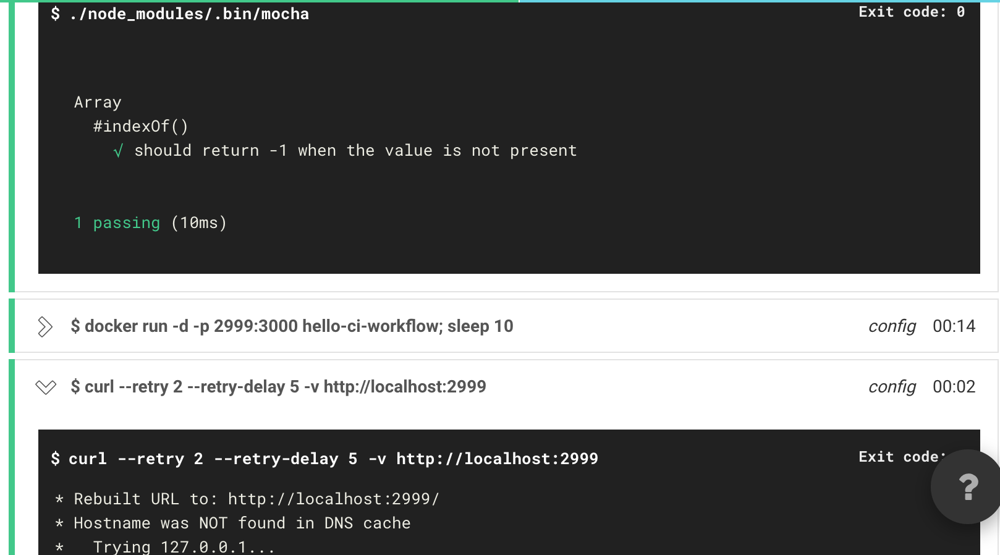

# hello-ci-workflow

## Target
偵測 GitHub 分支上的程式碼，若有更新則觸發 CircleCI 執行:
- 建置 Docker
- 單元測試

## Build

Please run the following command, and all environments required will be build automatic
```shell
npm istall
```
 
## Testing

Manually executes tests
```shell
./node_modules/.bin/mocha
```

## CircleCI testing result


## Reference
[Amo Wu 的 DevOps： 持續整合 ＆ 持續交付](http://blog.amowu.com/2015/04/devops-continuous-integration-delivery-docker-circleci-aws-beanstalk.html)

